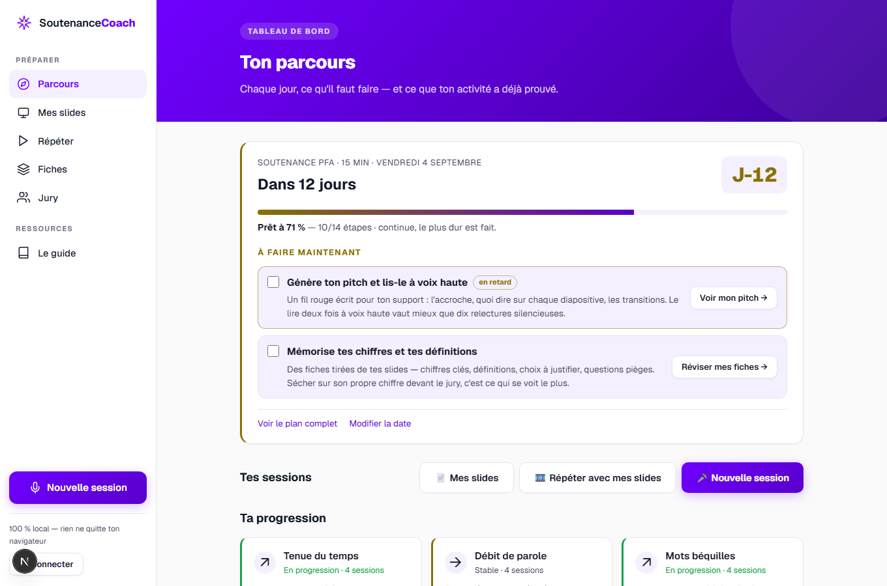
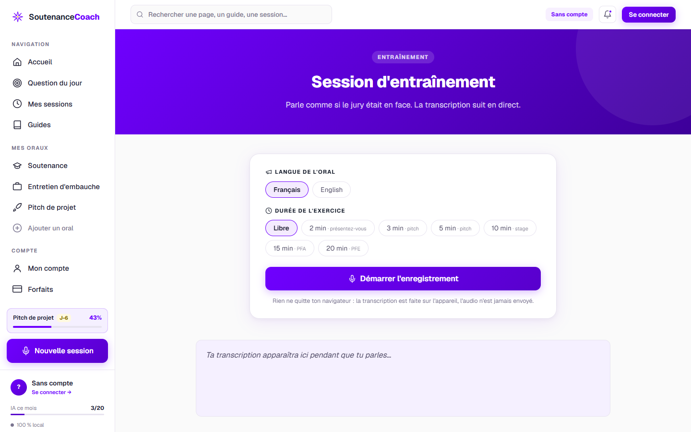

# 🎤 SoutenanceCoach

**Le coach d'entraînement oral qui se souvient.** Enregistre-toi en train de présenter,
obtiens une évaluation objective de ton élocution — et surtout, un suivi de ta progression
d'une session à l'autre.

### 👉 [Utiliser l'application](https://soutenance-coach.vercel.app)

Aucune installation, compte facultatif. Ouvre le lien dans Chrome ou Edge, autorise le micro,
et parle. *(Sans compte, tout reste sur ton appareil ; avec un compte Google, ton travail te suit
sur tous tes appareils — jamais l'audio.)*

> Hébergée sur Vercel. Chaque déploiement passe par la CI (types, 175 tests, build).

> Construit en août 2026 par [Zakaria Laaniba](https://laanibazakaria.github.io), élève-ingénieur
> en IA à l'ENSIAS, après un stage passé à fiabiliser une application d'IA en production.
> J'ai préparé ma propre soutenance avec.



---

## Le problème

Un étudiant qui prépare une soutenance s'entraîne devant un miroir ou un ami. Il n'obtient
aucune mesure objective — et surtout, **aucune mémoire** : personne ne peut lui dire
« tu dis toujours *du coup* toutes les trois phrases, et ça ne s'améliore pas depuis quatre
séances ». C'est pourtant exactement ce qu'un bon coach humain apporte.

## La philosophie : pourquoi le modèle de langage ne note jamais

Ce projet applique une règle apprise en production : **un score faux mais crédible est plus
dangereux qu'un crash.** Un modèle de langage se trompe de manière *plausible* — une note
fausse ressemble à une note juste, et rien ne la distingue.

Donc ici :

- **Chaque chiffre est calculé par du code déterministe et testé** (`lib/scoring/`,
  `lib/trends/`) : débit, densité de béquilles, longueur des phrases, structure, tenue du temps.
- **Quand les données ne suffisent pas, la métrique s'abstient.** Elle affiche « non mesuré »
  et explique pourquoi, plutôt que de produire un verdict sur du bruit. Trois exemples réels,
  chacun découvert en utilisant l'outil et verrouillé par un test :
  - une transcription hachée en fragments de 4 mots ne prouve pas des « phrases qui respirent » ;
  - un débit calculé sur une transcription qui a perdu 35 % des mots dit « je t'ai mal entendu »,
    pas « tu parles lentement » ;
  - une tendance sur deux points, c'est du bruit — il en faut **trois minimum**, sans exception.
- **Sans compte, aucune donnée ne quitte le navigateur** : tout vit dans le stockage local,
  vérifiable dans l'onglet Réseau. Le compte est une copie facultative (voir *Comptes*), et les
  fonctions IA n'envoient que le texte extrait des slides.

## En pratique

Tu choisis le format de ton exercice — les durées correspondent aux soutenances réelles
(PFA 15 min, PFE 20 min) — puis tu parles. La transcription suit en direct, et le minuteur
passe à l'orange dans les 10 % finaux, au rouge au dépassement.



## Ce que ça mesure

| Métrique | Ce qu'elle regarde | Quand elle s'abstient |
|---|---|---|
| **Tenue du temps** | Écart à la durée visée (mode soutenance) | Entraînement libre |
| **Débit de parole** | Mots/minute, zone de confort 110–160 | Session < 10 s, ou transcription peu fiable |
| **Mots béquilles** | « euh », « du coup », « en fait »… pour 100 mots | Aucun mot analysable |
| **Longueur des phrases** | Moyenne, et phrases de plus de 30 mots | Transcription hachée (< 7 mots/phrase) |
| **Structure annoncée** | Annonce de plan en intro, marqueur de conclusion | Session < 60 mots |

Et la mémoire : sur les **6 dernières sessions mesurables**, chaque métrique devient une
tendance — *en progression*, *stable*, *en recul* — avec les valeurs brutes
(« 12,5 → 0,8 béquilles pour 100 mots »). Stagner au bon niveau se dit « c'est acquis » ;
stagner au mauvais, « c'est TON point de travail prioritaire ».

## Et avec l'IA : pitch, questions de jury, simulation d'entretien

Dépose le PDF de tes slides. Seul le **texte extrait** est envoyé au modèle — jamais le fichier.

| Fonction | Ce que fait le modèle | Ce que fait le code |
|---|---|---|
| **🎬 Mon pitch** | Rédige l'accroche, ce que dire sur chaque diapositive, les transitions, la conclusion, trois conseils de livraison propres au support | Renormalise le minutage vers la durée visée — un modèle ne décide pas d'un chiffre |
| **🎓 Questions du jury** | Génère les questions *spécifiques* à ce projet : elles citent une technologie nommée, un chiffre avancé, un choix de conception, et pointent les faiblesses réelles | Interdit dans la consigne toute question posable à n'importe quel projet ; rattache chaque question à sa diapositive ; une banque de questions classiques reste disponible hors ligne |
| **💬 Avis du coach** | Compare la transcription d'une répétition aux diapositives : oublis (avec le numéro de diapositive), passages confus cités, phrases à reformuler, points forts, une priorité | Lui fournit les mesures déjà calculées comme des faits à ne pas contredire ; refuse tout avis hors format ; un avis par session, mis en cache et synchronisé |
| **🎤 Simulation d'entretien** | Donne son avis de jury sur ta réponse orale : ce qui fonctionne, ce qu'il relèverait, ce qu'il attendait, sa relance probable | Mesure longueur, hésitations, présence d'un exemple concret et temps de réaction — avant et indépendamment du modèle |

**Le modèle n'attribue jamais de note.** Chaque consigne le lui interdit explicitement, et une réponse hors format est refusée plutôt que présentée comme fiable.

Sans clé configurée, tout le reste fonctionne : l'analyse du support, les questions classiques, les mesures de réponse.

### Configuration

```
GEMINI_API_KEY=...        # clé Google AI Studio (palier gratuit suffisant)
GEMINI_MODEL=gemini-3.6-flash   # optionnel — Google retire régulièrement les anciens modèles
```

En local : dans `.env.local` (ignoré par git). Sur Vercel : *Settings → Environment Variables*.

## Comptes (optionnels) : retrouver son travail sur tous ses appareils

Sans compte, tout reste dans le navigateur. Avec un compte Google, les sessions, le support
et les résultats IA sont copiés sur le serveur et fusionnés d'un appareil à l'autre — **jamais
l'audio, jamais le PDF**, et chaque session reste supprimable. À la déconnexion, l'appareil est
vidé après un dernier envoi (sur un ordinateur partagé, la personne suivante ne voit rien) ; si le
serveur est injoignable, rien n'est effacé et l'utilisateur est prévenu.

Pile : [Auth.js](https://authjs.dev) (v5) + [Prisma](https://www.prisma.io) 7 + PostgreSQL
([Neon](https://neon.tech)). Ce que le navigateur stocke localement et ce que le serveur
stocke ont exactement la même forme : la synchronisation est une copie, pas une traduction
(`lib/sync/merge.ts`, testé).

### Mise en place

1. **Base de données** — sur Neon, créer un projet et copier la chaîne de connexion
   (*pooled*) dans `DATABASE_URL`. Puis :
   ```bash
   npm run db:migrate      # crée les tables (prisma/migrations)
   ```
2. **Google** — sur [console.cloud.google.com](https://console.cloud.google.com) → *APIs &
   Services → Credentials → Create OAuth client ID* (type *Web application*) :
   - *Authorized JavaScript origins* : `http://localhost:3000` et `https://soutenance-coach.vercel.app`
   - *Authorized redirect URIs* : `http://localhost:3000/api/auth/callback/google` et
     `https://soutenance-coach.vercel.app/api/auth/callback/google`
   - Copier l'identifiant et le secret dans `AUTH_GOOGLE_ID` / `AUTH_GOOGLE_SECRET`.
3. **Secret de session** — `AUTH_SECRET` : une chaîne aléatoire (`openssl rand -base64 32`).

Tant que ces variables manquent, le bouton « Se connecter » mène à une page qui l'explique,
et l'application fonctionne en mode local.

## Démarrer

```bash
npm install
npm run dev        # http://localhost:3000
```

**Prérequis navigateur** : Chrome ou Edge — la transcription utilise la Web Speech API.
L'application le dit explicitement si le navigateur ne la propose pas.

```bash
npm test           # 175 tests unitaires (Vitest)
npm run typecheck  # TypeScript strict
npm run build      # build de production
```

## Architecture

```
app/
├── page.tsx              Page d'accueil
├── app/                  Tableau de bord, session, support (pitch + jury), simulation, connexion
└── api/                  Routes serveur : IA (Gemini), comptes (Auth.js), synchronisation
lib/
├── scoring/              Les 5 métriques — fonctions pures, seuils exportés
├── trends/               La mémoire — pénalités normalisées, seuil minSessions
├── slides/ jury/ pitch/  Analyse du support, questions, pitch — consignes IA et garde-fous
├── sync/                 Fusion local ↔ compte (pure, testée)
├── storage.ts            Persistance locale, export/import JSON
└── types.ts
tests/unit/               175 tests, dont des fixtures de sessions réelles
```

Le cœur (`lib/`) n'a **aucune dépendance au DOM** : il se teste sans navigateur, et les
composants ne font que l'afficher. Les seuils sont exportés (`SEUILS`, `SEUILS_TENDANCES`)
pour rester critiquables plutôt que cachés dans le code.

## Limites connues (v1)

Elles sont écrites ici plutôt que découvertes à l'usage :

- **Chrome/Edge uniquement** — la Web Speech API n'est pas disponible partout.
- **La transcription française est imparfaite.** Les métriques sont conçues pour y résister
  (variantes de béquilles regroupées, marqueurs de conclusion tolérants, abstention si la
  confiance est basse), mais un micro éloigné dégrade la mesure. L'app le signale.
- **La tendance compare des moyennes de moitiés de fenêtre** : un pic isolé en bord de
  fenêtre pèse sur sa moitié. Comportement documenté et testé ; passage à la médiane prévu
  si l'usage le justifie.
- **Pas de découpage par section** (intro/développement/conclusion chronométrés séparément) :
  noté dans la fiche de mission comme évolution, pas construit en v1.

## Journal de bord

Ce projet a été construit en quatre étapes, chacune vérifiée par l'usage réel — et plusieurs
correctifs viennent directement de sessions d'entraînement enregistrées avec l'outil :

| Étape | Contenu |
|---|---|
| A | Socle : enregistrement, transcription temps réel, sessions locales |
| B | La grille : 5 métriques déterministes et leurs seuils |
| C | La mémoire : tendances multi-sessions, seuil de 3 sessions non négociable |
| D | Mode soutenance chronométré, export/import, accessibilité, publication |

La fiche de mission complète — rédigée **avant la première ligne de code** — est dans
[MISSION.md](MISSION.md), garde-fous compris.

## Licence

MIT.
